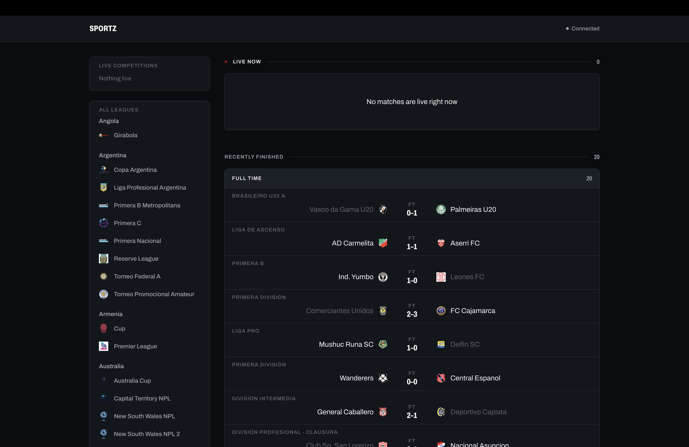
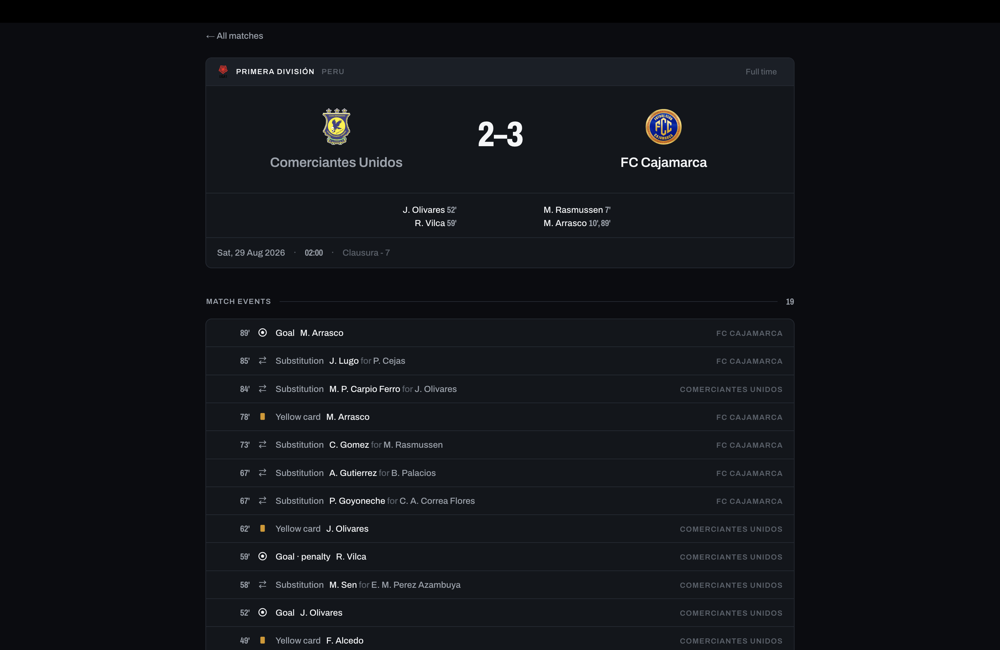

# Sportz

Live football scores. A poller pulls in-play fixtures from API-Football, persists
them to Postgres, and pushes score changes to browsers over WebSocket.

**Live:** [sportz-kappa.vercel.app](https://sportz-kappa.vercel.app/) ·
**API:** [sportz-xym6.onrender.com](https://sportz-xym6.onrender.com/health)

Express 5 · Postgres (Drizzle) · Upstash Redis · `ws` · Next.js 16 · Vitest

---

Entirely public and entirely read-only: no accounts, no writes, nothing to
configure. The job is a glance — what is the score right now, and did anything
just happen.



*Live section empty because the upstream account is suspended — see
[constraints](#design-decisions-and-constraints). Finished matches carry real
final scores, written by the reconciliation pass below.*



## Architecture

```
API-Football  ──▶  liveSync poller  ──▶  Postgres  ──▶  REST (GET only)  ──▶  Next.js
  /fixtures        (distributed lock)     (Drizzle)         │
   ?live=all              │                                 └─▶  WebSocket /ws  ──▶  browser
                          └── Redis: TTL read cache + poll lock
```

Requests flow `routes → zod validation → services → drizzle`. No repository
layer; services own their DB access. Four properties are load-bearing:

- **`liveSync.js` is the sole writer.** Every upsert is called from there.
- **One `/fixtures?live=all` request yields fixtures, leagues *and* events.**
  Fetching either separately would multiply quota cost by the live match count.
- **Events are snapshot-replace**, delete-then-insert in one transaction.
  Upstream events carry no stable id, and a composite natural key would both
  duplicate rows (NULLs compare distinct in Postgres) and strand VAR-retracted
  events forever: an upsert structurally cannot make a goal *disappear*.
- **An empty WebSocket subscription set means receive everything**; a non-empty
  set narrows. The list page holds none and depends on the firehose; the detail
  page subscribes to one match. Same server, both correct.

## Notable engineering problems

**885 matches were stuck live, and no code path could ever have unstuck them.**
`/fixtures?live=all` returns in-play fixtures only, so a match that ends simply
disappears and its row is never touched again. The fix is two-tier. Tier 1 is a
time floor: a row still `live` whose scheduled kickoff is over six hours old
cannot be live. It costs zero API requests and never consults the feed, so it
holds when the API is down or returns empty — exactly the cases where reading
absence as "finished" would be catastrophic. Tier 2 recovers what inference
cannot, the real final score, by confirming departures against
`/fixtures?date=`. Absence only earns a match the right to be *asked about*; the
write comes entirely from the status the API reports back.

**The event vocabulary lies, in two different ways.** API-Football files a
missed penalty under `type: 'Goal'`, alongside Normal Goal, Penalty and Own
Goal, so keying the display on `type` renders a miss as a goal — the exact
opposite of what happened. `Var` with detail `"Goal Disallowed"` is a
retraction. The frontend therefore branches on `detail`, null on exactly 1 of
2,558 rows measured. Separately, penalty *shootout* kicks arrive as ordinary
`Goal / Penalty` rows at minute 90, inflating the scorer summary. The filter
uses an exact upstream marker (`metadata.comments === 'Penalty Shootout'`, on
nothing else in 2,558 rows) rather than a `minute >= 90` heuristic, which would
have discarded a genuine 90th-minute missed penalty in match 1216. Marker, not
pattern.

**The test suite truncated the production database.** `db.js` read
`DATABASE_URL` at module load and imported `dotenv/config`, so the test-time
redirect lost a race and importing anything bound the pool to production. The
fix is three independent layers, because any one can be defeated.
`tests/setup.js` loads dotenv first, then redirects. `db.js` defers both pool
construction and the env read to first property access through a Proxy, and
imports no dotenv. The integration suite's `beforeAll` compares the two
hostnames and throws rather than run.

**Two distinct pg-pool crash paths, not one.** A hosted Postgres dropping an
idle connection was killing the process: pg-pool re-emits idle-client errors
onto the pool, and in Node an `'error'` with no listener is an unhandled
exception. Adding a pool listener fixed that stack and the process kept
crashing. pg-pool attaches its `idleListener` on release and *removes it on
checkout*, so an error on a checked-out or connecting client reaches no listener
at all. Different path, different stack. Each needed its own listener, and each
was mutation-tested by reproducing the identical production stack frame.

**A cache that never hits and never errors is invisible.** Adding a `JSON.parse`
to `cacheGet` as a deliberate mutation did not throw: the graceful-degradation
wrapper caught it, logged at `warn`, and returned null, which the cache reads as
an ordinary miss. The fault would have surfaced only as quota burn, with no
error anywhere. So `/debug/stats` reports `enabled` beside hits and misses and
tracks `skipped` separately, and its `cacheStatus` says `never-hit` outright
rather than leaving it to be inferred.

**API-Football returns HTTP 200 on failure.** The envelope's `errors` field is
polymorphic: `[]` on success, an *object* keyed by error kind on failure. The
obvious `errors.length` check silently passes the failure shape and hands you a
successful-looking empty response. Everything goes through `collectErrors`.

## Design decisions and constraints

- **100 requests/day on the free tier, so the poller runs at 20-minute
  intervals** (72/day, plus up to 24 reconciliation sweeps and one boot
  `/status` = 97 of 100). Delivery is genuinely real-time: a frame goes out the
  moment a poll writes. But *knowledge* is capped at the poll interval. The push
  is instant; what it pushes can be 20 minutes old.
- **The upstream API account is currently suspended**, for the third time, so
  the live feed is dry and the deployment serves the historical data already in
  the database. That is also how the two-tier reconciliation came to be verified
  against a genuinely dead API rather than a simulated one — the exact scenario
  where a naive "absent means finished" pass would have marked all 885 finished
  at once. It degrades as designed: the time floor still runs, nothing crashes.
- **No auth.** Read-only public data, no accounts, no write endpoints.
- **Arcjet is disabled in production** (`ARCJET_KEY` unset short-circuits the
  middleware). Its `detectBot` rule was 403ing the frontend's own
  server-rendered requests, which reach the API from Vercel as HeadlessChrome on
  a datacenter IP and match neither `CATEGORY:SEARCH_ENGINE` nor
  `CATEGORY:PREVIEW`. An allow-list guarding a read-only API with no writes was
  not worth building.
- **Standings sync is off** unless `STANDINGS_SYNC_ENABLED` is exactly `'true'`.
  The free tier cannot read current-season standings, and it costs one request
  per competition per cycle.
- **Cache invalidation is TTL-only.** Writes invalidate nothing, so staleness is
  bounded by a TTL far shorter than the poll interval.
- **Render's free tier hibernates.** An external cron-job.org ping hits
  `/health` every 10 minutes. Nothing in this repo configures it.

Deferred work, each with the trigger that makes it due, is in
[FOLLOWUPS.md](FOLLOWUPS.md); architectural invariants are in
[CLAUDE.md](CLAUDE.md).

## Testing

224 tests across 9 files, run serially (`fileParallelism: false`) because two
suites TRUNCATE the same database and in parallel wipe each other's rows.

The integration suite runs against **real Postgres**, not a mock: the
reconciliation time floor is one SQL predicate on the database clock, and only a
real database proves the cutoff selects the right rows. Two suites `skipIf` on a
missing env var, so a green summary can mean nothing ran. **A run is only
trusted at zero skips.**

Safety-critical code is mutation-tested: break the guard, confirm the *right*
test fails by name, revert, confirm byte-identical — and prove the mutation
applied and still parses, since an unapplied one reads as "survived" and a
syntax error reads as "load-bearing".

## Running locally

Needs Node 22+, Postgres, and an API-Football key. Redis is optional: with the
Upstash vars unset, caching and locking become no-ops.

```bash
cp .env.example .env     # fill in DATABASE_URL and API_FOOTBALL_KEY
npm install
npm run db:migrate
npm run dev              # http://localhost:8000, ws://localhost:8000/ws
```

```bash
cd client && npm install
npm run dev              # http://localhost:3000
```

Tests need `TEST_DATABASE_URL` on a **separate** database — the suite
truncates. Without it the integration suites skip.

```bash
npm test
```

Every environment variable is documented in [.env.example](.env.example).
Migrations: edit `src/db/schema.js`, then `db:generate`, then `db:migrate` —
never hand-write into `drizzle/`.
